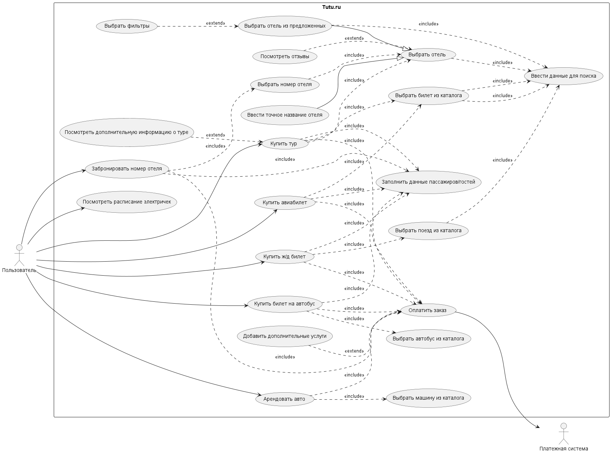

# Лабораторная работа №3

## Вариант 331483

- Сделал: Козьяков Арсений Дмитриевич
- Проверила: Наумова Надежда Александровна

## Задание

Сформировать варианты использования, разработать на их основе тестовое покрытие покрытие и провести функциональное тестирование интерфейса сайта (в соответствии с вариантом).

Вариант №331483: Tutu.Ru - <http://www.tutu.ru/>

## Выполение

Поскольку данные тесты, во-первых, медленные и дорогие, нет необходимости в полном покрытии автотестами. Достаточно будет проверить работу основной логики, а также места, из-за ошибок в которых можно понести убытки. Касательно моего варианта: не будем проверять каждую вкладку, например, "Это выгодно!" на главной странице, но проверим возможность выполнения основных бизнес функций.

use-case Диаграмма

Распишем прецеденты использования

|       Прецедент       | Поиск отелей                                                                                                                                                                                      |
| :-------------------: | ------------------------------------------------------------------------------------------------------------------------------------------------------------------------------------------------- |
|          ID           | 1                                                                                                                                                                                                 |
|    Главные актеры     | Пользователь                                                                                                                                                                                      |
| Второстепенные актеры | нет                                                                                                                                                                                               |
|      Предусловия      | Есть хотя бы один отель, удовлетворяющий условиям поиска   Пользователь находится на [главной странице](https://www.tutu.ru)                                                                   |
|    Основной поток     | 1.1 Пользоваль вводит критерии поиска   1.2 Пользователь подтверждает поиск   1.3 Пользователь перенаправляется на домен hotel.tutu.ru, с результатами, удовлетваряющими введеным критериям |

|       Прецедент       | Поиск Авиабилетов                                                                                                                                                                                |
| :-------------------: | ------------------------------------------------------------------------------------------------------------------------------------------------------------------------------------------------ |
|          ID           | 2                                                                                                                                                                                                |
|    Главные актеры     | Пользователь                                                                                                                                                                                     |
| Второстепенные актеры | нет                                                                                                                                                                                              |
|      Предусловия      | Есть хотя бы один авиабилет, удовлетворяющий условиям поиска   Пользователь находится на [главной странице](https://www.tutu.ru)                                                              |
|    Основной поток     | 1.1 Пользоваль вводит критерии поиска   1.2 Пользователь подтверждает поиск   1.3 Пользователь перенаправляется на домен avia.tutu.ru, с результатами, удовлетваряющими введеным критериям |

|       Прецедент       | Поиск Ж/д билетов                                                                                                                                                                           |
| :-------------------: | ------------------------------------------------------------------------------------------------------------------------------------------------------------------------------------------- |
|          ID           | 3                                                                                                                                                                                           |
|    Главные актеры     | Пользователь                                                                                                                                                                                |
| Второстепенные актеры | нет                                                                                                                                                                                         |
|      Предусловия      | Есть хотя бы один Ж/д билет, удовлетворяющий условиям поиска   Пользователь находится на [главной странице](https://www.tutu.ru)                                                         |
|    Основной поток     | 1.1 Пользоваль вводит критерии поиска   1.2 Пользователь подтверждает поиск   1.3 Пользователь перенаправляется на домен tutu.ru, с результатами, удовлетваряющими введеным критериям |

|       Прецедент       | Поиск билетов на автобус                                                                                                                                                                        |
| :-------------------: | ----------------------------------------------------------------------------------------------------------------------------------------------------------------------------------------------- |
|          ID           | 4                                                                                                                                                                                               |
|    Главные актеры     | Пользователь                                                                                                                                                                                    |
| Второстепенные актеры | нет                                                                                                                                                                                             |
|      Предусловия      | Есть хотя бы один билет на автобус, удовлетворяющий условиям поиска   Пользователь находится на [главной странице](https://www.tutu.ru)                                                      |
|    Основной поток     | 1.1 Пользоваль вводит критерии поиска   1.2 Пользователь подтверждает поиск   1.3 Пользователь перенаправляется на домен bus.tutu.ru, с результатами, удовлетваряющими введеным критериям |

|       Прецедент       | Фильтрация и сортировка полученных результатов                                                                                                                                                                                               |
| :-------------------: | -------------------------------------------------------------------------------------------------------------------------------------------------------------------------------------------------------------------------------------------- |
|          ID           | 5                                                                                                                                                                                                                                            |
|   Краткое описание    | Использование фильтров и сортировки для уточнения результатов                                                                                                                                                                                |
|    Главные актеры     | Пользователь                                                                                                                                                                                                                                 |
| Второстепенные актеры | нет                                                                                                                                                                                                                                          |
|      Предусловия      | 1. Пользователь находится на странице поиска, которая поддерживает фильтры и сортировку. (Например, страница поиска отелей - поддерживает, билетов на автобус - нет)   2. есть результаты (билеты, отели и т.п), удовлетворяющие фильтрам |
|    Основной поток     | 1.1 Пользователь выбирает необходимый критерий сортировки   1.2 Пользователь выбирает фильтры из предложенных                                                                                                                             |

|       Прецедент       | Бронирование конкретного отеля                                                 |
| :-------------------: | ------------------------------------------------------------------------------ |
|          ID           | 6                                                                              |
|    Главные актеры     | Пользователь                                                                   |
| Второстепенные актеры | нет                                                                            |
|      Предусловия      | Пользователь находится на странице поиска Отелей                               |
|    Основной поток     | 1.1 Пользователь выбирает желаемый отель   1.3 Пользователь бронирует отель |
| Альтернативный поток  | 1.2 ALT (Прецедент 7) Пользователь выбирает номер                              |

|       Прецедент       | Выбор номера отеля                                                                                                                                          |
| :-------------------: | ----------------------------------------------------------------------------------------------------------------------------------------------------------- |
|          ID           | 7                                                                                                                                                           |
|    Главные актеры     | Пользователь                                                                                                                                                |
| Второстепенные актеры | нет                                                                                                                                                         |
|      Предусловия      | Пользователь выбрал Отель типа Отель (есть еще Отель типа апартаменты, где не надо выбирать номер)   Пользователь находится на странице выбранного отеля |
|    Основной поток     | 1.1 Пользователь выбирает желаемый номер                                                                                                                    |

Напишем чек-лист

### Чек-лист

|                                                                ID                                                                 | Status |
| :-------------------------------------------------------------------------------------------------------------------------------: | ------ |
|                   [Поиск отелей с минимальными параметрами](#id-1---поиск-отелей-только-с-необходимыми-полями)                    | ✅     |
|                       [Поиск отелей с детьми всех возрастов](#id-2---поиск-отелей-с-детьми-всех-возрастов)                        | ✅     |
|                 [Поиск авиабилетов с минимальными параметрами](#id-3---простой-поиск-авиабилетов-в-одну-сторону)                  | ✅     |
|                             [Поиск авиабилетов бизнес класса](#id-4---поиск-авиабилетов-бизнес-класс)                             | ✅     |
|                             [Поиск авиабилетов туда-обратно](#id-5---поиск-авиабилетов-туда-обратно)                              | ✅     |
|                   [Поиск авиабилетов с детьми до 2 лет](#id-6---поиск-авиабилетов-с-детьми-до-2х-лет-без-места)                   | ✅     |
|                      [Поиск авиабилетов с детьми старше 2х лет](#id-7---поиск-авиабилетов-с-детьми-с-местом)                      | ✅     |
|                 [Поиск авивбилетов с детьми разных возрастов](#id-8---поиск-авиабилетов-с-детьми-обеих-категорий)                 | ✅     |
|                          [Поиск жд билетов с минимальными параметрами](#id-9---простой-поиск-жд-билетов)                          | ✅     |
|                                  [Поиск жд билетов с детьми](#id-10---поиск-жд-билетов-с-детьми)                                  | ✅     |
|                      [Поиск автобусных билетов с минимальными параметрами](#id-11---простой-поиск-автобусов)                      | ✅     |
|                              [Поиск автобусных билетов с детьми](#id-12---поиск-автобусов-с-детьми)                               | ✅     |
|                         [Фильтрация отелей по типу](#id-13---фильтрация-результатов-поиска-по-типу-отели)                         | ✅     |
|                      [Фильтрация отелей по возрастанию цены](#id-14---сортировка-отелей-по-возрастанию-цены)                      | ✅     |
|                         [Фильтрация отелей по убыванию цены](#id-15---сортировка-отелей-по-убыванию-цены)                         | ✅     |
|               [Фильтрация отелей по диапозону "Цена за ночь"](#id-16---фильтрация-отелей-по-диапазону-цен-за-ночь)                | ✅     |
|      [Фильтрация авиабилетов по наличию багажа и прямой](#id-17---фильтрация-авиабилетов-по-параметрам-прямой-рейс-и-багаж)       | ✅     |
|                     [Фильтрация авиабилетов по авиакомпании](#id-18---фильтрация-авиабилетов-по-авиакомпании)                     | ✅     |
|  [Сортировка авиабилетов по времени вылета - сначала ранние](#id-19---сортировка-авиабилетов-по-времени-вылета---сначала-ранние)  | ✅     |
| [Сортировка авиабилетов по времени вылета - сначала поздние](#id-20---сортировка-авиабилетов-по-времени-вылета---сначала-поздние) | ✅     |
|            [Сортировка авиабилетов по цене (сначала дешевые)](#id-21---сортировка-авиабилетов-по-цене-сначала-дешёвые)            | ✅     |
|               [Сортировка жд билетов по времени отправления](#id-22---сортировка-жд-билетов-по-времени-отправления)               | ✅     |
|                  [Сортировка жд билетов по времени прибытия](#id-23---сортировка-жд-билетов-по-времени-прибытия)                  | ✅     |
|             [Сортировка жд билетов по цене (сначала дешевые)](#id-24---сортировка-жд-билетов-по-цене-сначала-дешёвые)             | ✅     |
|                     [Фильтрация жд билетов по типу поезда](#id-25---фильтрация-по-типу-поезда-сапсанласточка)                     | ✅     |
|                                [Фильтрация по типам вагонов](#id-26---фильтрация-по-типам-вагонов)                                | ✅     |
|                 [Е2Е тест - от поиска до оплаты отеля](#id-27---тест-страницы-поиска-отелей-до-оплаты-отеля-e2e)                  | ✅     |
|          [Е2Е тест - от поиска до оплаты апартаментов](#id-28---тест-страницы-поиска-отелей-до-оплаты-апартаментов-e2e)           | ✅     |

Перейдем к тест-кейсам

## Test-cases

### ID: 1 - Поиск отелей только с необходимыми полями

#### Предусловия

| номер | предусловие                                                       |
| :---: | ----------------------------------------------------------------- |
|   1   | Пользователь находится на [главной странице](https://www.tutu.ru) |

#### Окружение

#### Шаги

| номер | действие                                                    |
| :---: | ----------------------------------------------------------- |
|   1   | Перейти в раздел отели                                      |
|   2   | Ввести в поле ввода "Город, отель или направление" "Москва" |
|   3   | Выбрать даты 29.06.2026 - 12.07.2026                        |
|   4   | В меню пассажиров установить количество взрослых: 3         |
|   5   | Нажать "найти"                                              |

#### Ожидаемый результат тест-кейса

Произошел редирект на страницу поиска отелей (домен hotel.tutu.ru), результаты соответствуют заданным критериям.

#### Статус

✅ Passed

---

### ID: 2 - Поиск отелей с детьми (всех возрастов)

#### Предусловия

| номер | предусловие                                                       |
| :---: | ----------------------------------------------------------------- |
|   1   | Пользователь находится на [главной странице](https://www.tutu.ru) |

#### Окружение

#### Шаги

| номер | действие                                                                 |
| :---: | ------------------------------------------------------------------------ |
|   1   | Перейти в раздел отели                                                   |
|   2   | Ввести в поле ввода "Город, отель или направление" "Москва"              |
|   3   | Выбрать даты 29.06.2026 - 12.07.2026                                     |
|   4   | В меню пассажиров установить количество взрослых: 3                      |
|   5   | Добавить 4 детей с возрастами: "Меньше года", "1 год", "2 года", "5 лет" |
|   6   | Нажать "найти"                                                           |

#### Ожидаемый результат тест-кейса

Произошел редирект на страницу поиска отелей (домен hotel.tutu.ru), результаты соответствуют заданным критериям.

#### Статус

✅ Passed

---

### ID: 3 - Простой поиск авиабилетов (в одну сторону)

#### Предусловия

| номер | предусловие                                                       |
| :---: | ----------------------------------------------------------------- |
|   1   | Пользователь находится на [главной странице](https://www.tutu.ru) |

#### Окружение

#### Шаги

| номер | действие                                            |
| :---: | --------------------------------------------------- |
|   1   | Перейти в раздел Авиабилеты                         |
|   2   | В поле "Откуда" ввести "Москва"                     |
|   3   | В поле "Куда" ввести "Сочи"                         |
|   4   | Выбрать дату отправления: 29.06.2026                |
|   5   | В меню пассажиров установить количество взрослых: 3 |
|   6   | Выбрать класс эконом, если не выбран                |
|   7   | Нажать "найти"                                      |

#### Ожидаемый результат тест-кейса

Произошел редирект на страницу результатов поиска авиабилетов (домен avia.tutu.ru), результаты соответствуют заданным критериям.

#### Статус

✅ Passed

---

### ID: 4 - Поиск авиабилетов (Бизнес-класс)

#### Предусловия

| номер | предусловие                                                       |
| :---: | ----------------------------------------------------------------- |
|   1   | Пользователь находится на [главной странице](https://www.tutu.ru) |

#### Окружение

#### Шаги

| номер | действие                                            |
| :---: | --------------------------------------------------- |
|   1   | Перейти в раздел Авиабилеты                         |
|   2   | В поле "Откуда" ввести "Москва"                     |
|   3   | В поле "Куда" ввести "Сочи"                         |
|   4   | Выбрать дату отправления: 29.06.2026                |
|   5   | В меню пассажиров установить количество взрослых: 3 |
|   6   | Изменить класс перелета на "Бизнес"                 |
|   7   | Нажать "найти"                                      |

#### Ожидаемый результат тест-кейса

Произошел редирект на страницу результатов поиска авиабилетов с фильтром по бизнес-классу. Результаты соответствуют заданным критериям.

#### Статус

✅ Passed

---

### ID: 5 - Поиск авиабилетов (Туда-обратно)

#### Предусловия

| номер | предусловие                                                       |
| :---: | ----------------------------------------------------------------- |
|   1   | Пользователь находится на [главной странице](https://www.tutu.ru) |

#### Окружение

#### Шаги

| номер | действие                                              |
| :---: | ----------------------------------------------------- |
|   1   | Перейти в раздел Авиабилеты                           |
|   2   | В поле "Откуда" ввести "Москва"                       |
|   3   | В поле "Куда" ввести "Сочи"                           |
|   4   | Выбрать даты: туда — 29.06.2026, обратно — 12.07.2026 |
|   5   | В меню пассажиров установить количество взрослых: 3   |
|   6   | Выбрать класс эконом, если не выбран                  |
|   7   | Нажать "найти"                                        |

#### Ожидаемый результат тест-кейса

Произошел редирект на страницу результатов поиска авиабилетов с учетом обратного билета. Результаты соответствуют заданным критериям.

#### Статус

✅ Passed

---

### ID: 6 - Поиск авиабилетов с детьми до 2х лет (без места)

#### Предусловия

| номер | предусловие                                                       |
| :---: | ----------------------------------------------------------------- |
|   1   | Пользователь находится на [главной странице](https://www.tutu.ru) |

#### Окружение

#### Шаги

| номер | действие                                              |
| :---: | ----------------------------------------------------- |
|   1   | Перейти в раздел Авиабилеты                           |
|   2   | В поле "Откуда" ввести "Москва"                       |
|   3   | В поле "Куда" ввести "Сочи"                           |
|   4   | Выбрать дату отправления: 29.06.2026                  |
|   5   | В меню пассажиров установить количество взрослых: 3   |
|   6   | Добавить 2 детей с возрастами: "Меньше года", "1 год" |
|   7   | Выбрать класс эконом, если не выбран                  |
|   8   | Нажать "найти"                                        |

#### Ожидаемый результат тест-кейса

Произошел редирект на страницу результатов поиска авиабилетов с учетом добавленных младенцев. Результаты соответствуют заданным критериям.

#### Статус

✅ Passed

---

### ID: 7 - Поиск авиабилетов с детьми (с местом)

#### Предусловия

| номер | предусловие                                                       |
| :---: | ----------------------------------------------------------------- |
|   1   | Пользователь находится на [главной странице](https://www.tutu.ru) |

#### Окружение

#### Шаги

| номер | действие                                            |
| :---: | --------------------------------------------------- |
|   1   | Перейти в раздел Авиабилеты                         |
|   2   | В поле "Откуда" ввести "Москва"                     |
|   3   | В поле "Куда" ввести "Сочи"                         |
|   4   | Выбрать дату отправления: 29.06.2026                |
|   5   | В меню пассажиров установить количество взрослых: 3 |
|   6   | Добавить 2 детей с возрастами: "3 года", "5 лет"    |
|   7   | Выбрать класс эконом, если не выбран                |
|   8   | Нажать "найти"                                      |

#### Ожидаемый результат тест-кейса

Произошел редирект на страницу результатов поиска авиабилетов с учетом детей старше 2-х лет. Результаты соответствуют заданным критериям.

#### Статус

✅ Passed

---

### ID: 8 - Поиск авиабилетов с детьми обеих категорий

#### Предусловия

| номер | предусловие                                                       |
| :---: | ----------------------------------------------------------------- |
|   1   | Пользователь находится на [главной странице](https://www.tutu.ru) |

#### Окружение

#### Шаги

| номер | действие                                                                 |
| :---: | ------------------------------------------------------------------------ |
|   1   | Перейти в раздел Авиабилеты                                              |
|   2   | В поле "Откуда" ввести "Москва"                                          |
|   3   | В поле "Куда" ввести "Сочи"                                              |
|   4   | Выбрать дату отправления: 29.06.2026                                     |
|   5   | В меню пассажиров установить количество взрослых: 3                      |
|   6   | Добавить 4 детей с возрастами: "Меньше года", "1 год", "2 года", "5 лет" |
|   7   | Выбрать класс эконом, если не выбран                                     |
|   8   | Нажать "найти"                                                           |

#### Ожидаемый результат тест-кейса

Произошел редирект на страницу результатов поиска авиабилетов с учетом пассажиров всех возрастных групп. результаты соответствуют заданным критериям.

#### Статус

✅ Passed

---

### ID: 9 - Простой поиск Ж/Д билетов

#### Предусловия

| номер | предусловие                                                       |
| :---: | ----------------------------------------------------------------- |
|   1   | Пользователь находится на [главной странице](https://www.tutu.ru) |

#### Окружение

#### Шаги

| номер | действие                                     |
| :---: | -------------------------------------------- |
|   1   | Перейти в раздел Ж/Д билеты                  |
|   2   | В поле "Откуда" ввести "Москва"              |
|   3   | В поле "Куда" ввести "Сочи"                  |
|   4   | Выбрать дату отправления: 29.06.2026         |
|   5   | Установить количество взрослых пассажиров: 3 |
|   6   | Нажать "найти"                               |

#### Ожидаемый результат тест-кейса

Произошел редирект на страницу результатов поиска поездов (домен train.tutu.ru). Результаты соответствуют заданным критериям.

#### Статус

✅ Passed

---

### ID: 10 - Поиск Ж/Д билетов с детьми

#### Предусловия

| номер | предусловие                                                       |
| :---: | ----------------------------------------------------------------- |
|   1   | Пользователь находится на [главной странице](https://www.tutu.ru) |

#### Окружение

#### Шаги

| номер | действие                                                                 |
| :---: | ------------------------------------------------------------------------ |
|   1   | Перейти в раздел Ж/Д билеты                                              |
|   2   | В поле "Откуда" ввести "Москва"                                          |
|   3   | В поле "Куда" ввести "Сочи"                                              |
|   4   | Выбрать дату отправления: 29.06.2026                                     |
|   5   | Установить количество взрослых пассажиров: 3                             |
|   6   | Добавить 4 детей с возрастами: "Меньше года", "1 год", "2 года", "5 лет" |
|   7   | Нажать "найти"                                                           |

#### Ожидаемый результат тест-кейса

Произошел редирект на страницу результатов поиска поездов с учетом добавленных детей. Результаты соответствуют заданным критериям.

#### Статус

✅ Passed

---

### ID: 11 - Простой поиск автобусов

#### Предусловия

| номер | предусловие                                                       |
| :---: | ----------------------------------------------------------------- |
|   1   | Пользователь находится на [главной странице](https://www.tutu.ru) |

#### Окружение

#### Шаги

| номер | действие                                     |
| :---: | -------------------------------------------- |
|   1   | Перейти в раздел Автобусы                    |
|   2   | В поле "Откуда" ввести "Москва"              |
|   3   | В поле "Куда" ввести "Сочи"                  |
|   4   | Выбрать дату отправления: 29.06.2026         |
|   5   | Установить количество взрослых пассажиров: 3 |
|   6   | Нажать "найти"                               |

#### Ожидаемый результат тест-кейса

Произошел редирект на страницу результатов поиска автобусных рейсов (домен bus.tutu.ru). Результаты соответствуют заданным критериям.

#### Статус

✅ Passed

---

### ID: 12 - Поиск автобусов с детьми

#### Предусловия

| номер | предусловие                                                       |
| :---: | ----------------------------------------------------------------- |
|   1   | Пользователь находится на [главной странице](https://www.tutu.ru) |

#### Окружение

#### Шаги

| номер | действие                                                                 |
| :---: | ------------------------------------------------------------------------ |
|   1   | Перейти в раздел Автобусы                                                |
|   2   | В поле "Откуда" ввести "Москва"                                          |
|   3   | В поле "Куда" ввести "Сочи"                                              |
|   4   | Выбрать дату отправления: 29.06.2026                                     |
|   5   | Установить количество взрослых пассажиров: 3                             |
|   6   | Добавить 4 детей с возрастами: "Меньше года", "1 год", "2 года", "5 лет" |
|   7   | Нажать "найти"                                                           |

#### Ожидаемый результат тест-кейса

Произошел редирект на страницу результатов поиска автобусных рейсов с учетом детских билетов. Результаты соответствуют заданным критериям.

#### Статус

✅ Passed

### ID: 13 - Фильтрация результатов поиска по типу "Отели"

#### Предусловия

| номер | предусловие                                                              |
| :---: | ------------------------------------------------------------------------ |
|   1   | Пользователь находится на [главной странице](https://www.tutu.ru)        |
|   2   | Выполнен поиск: город "Москва", даты 29.06.2026 — 12.07.2026, 2 взрослых |
|   3   | Пользователь находится на странице выдачи результатов поиска отелей      |

#### Окружение

#### Шаги

| номер | действие                                   |
| :---: | ------------------------------------------ |
|   1   | В блоке фильтров выбрать категорию "Отели" |

#### Ожидаемый результат тест-кейса

Список результатов обновился. Все отображаемые объекты имеют тип жилья "Отель".

#### Статус

✅ Passed

---

### ID: 14 - Сортировка отелей по возрастанию цены

#### Предусловия

| номер | предусловие                                                              |
| :---: | ------------------------------------------------------------------------ |
|   1   | Пользователь находится на [главной странице](https://www.tutu.ru)        |
|   2   | Выполнен поиск: город "Москва", даты 29.06.2026 — 12.07.2026, 2 взрослых |
|   3   | Пользователь находится на странице выдачи результатов поиска отелей      |

#### Окружение

#### Шаги

| номер | действие                                            |
| :---: | --------------------------------------------------- |
|   1   | В меню сортировки выбрать вариант "Сначала дешёвые" |

#### Ожидаемый результат тест-кейса

Список отелей отсортировался по цене. Отели отображаются в порядке возрастания цены (от самого дешевого к самому дорогому).

#### Статус

✅ Passed

---

### ID: 15 - Сортировка отелей по убыванию цены

#### Предусловия

| номер | предусловие                                                              |
| :---: | ------------------------------------------------------------------------ |
|   1   | Пользователь находится на [главной странице](https://www.tutu.ru)        |
|   2   | Выполнен поиск: город "Москва", даты 29.06.2026 — 12.07.2026, 2 взрослых |
|   3   | Пользователь находится на странице выдачи результатов поиска отелей      |

#### Окружение

#### Шаги

| номер | действие                                            |
| :---: | --------------------------------------------------- |
|   1   | В меню сортировки выбрать вариант "Сначала дорогие" |

#### Ожидаемый результат тест-кейса

Список отелей отсортировался по цене. Отели отображаются в порядке убывания цены (от самого дорогого к самому дешевому).

#### Статус

✅ Passed

---

### ID: 16 - Фильтрация отелей по диапазону цен за ночь

#### Предусловия

| номер | предусловие                                                              |
| :---: | ------------------------------------------------------------------------ |
|   1   | Пользователь находится на [главной странице](https://www.tutu.ru)        |
|   2   | Выполнен поиск: город "Москва", даты 29.06.2026 — 12.07.2026, 2 взрослых |
|   3   | Пользователь находится на странице выдачи результатов поиска отелей      |

#### Окружение

#### Шаги

| номер | действие                                                         |
| :---: | ---------------------------------------------------------------- |
|   1   | В фильтре "Цена за ночь" установить минимальное значение: 5000   |
|   2   | В фильтре "Цена за ночь" установить максимальное значение: 15000 |

#### Ожидаемый результат тест-кейса

В выдаче остались только те отели, стоимость проживания в которых входит в диапазон от 5000 до 15000 рублей.

#### Статус

✅ Passed

### ID: 17 - Фильтрация авиабилетов по параметрам (Прямой рейс и Багаж)

#### Предусловия

| номер | предусловие                                                                              |
| :---: | ---------------------------------------------------------------------------------------- |
|   1   | Пользователь находится на [главной странице](https://www.tutu.ru)                        |
|   2   | Выполнен поиск авиабилетов: "Москва" — "Сочи", дата 29.06.2026, 1 взрослый, класс Эконом |
|   3   | Пользователь находится на странице результатов поиска авиабилетов                        |

#### Окружение

#### Шаги

| номер | действие                                    |
| :---: | ------------------------------------------- |
|   1   | Применить фильтр "Прямой" в блоке пересадок |
|   2   | Применить фильтр "С багажом" в блоке багажа |

#### Ожидаемый результат тест-кейса

В выдаче отображаются только прямые рейсы, и каждый найденный билет включает в себя багаж.

#### Статус

✅ Passed

---

### ID: 18 - Фильтрация авиабилетов по авиакомпании

#### Предусловия

| номер | предусловие                                                                              |
| :---: | ---------------------------------------------------------------------------------------- |
|   1   | Пользователь находится на [главной странице](https://www.tutu.ru)                        |
|   2   | Выполнен поиск авиабилетов: "Москва" — "Сочи", дата 29.06.2026, 1 взрослый, класс Эконом |
|   3   | Пользователь находится на странице результатов поиска авиабилетов                        |

#### Окружение

#### Шаги

| номер | действие                                                                                      |
| :---: | --------------------------------------------------------------------------------------------- |
|   1   | В фильтре "Авиакомпании" выбрать конкретную компанию (например, "S7 Airlines" или "Аэрофлот") |

#### Ожидаемый результат тест-кейса

В списке результатов отображаются билеты только выбранной авиакомпании.

#### Статус

✅ Passed

---

### ID: 19 - Сортировка авиабилетов по времени вылета - сначала ранние

#### Предусловия

| номер | предусловие                                                                              |
| :---: | ---------------------------------------------------------------------------------------- |
|   1   | Пользователь находится на [главной странице](https://www.tutu.ru)                        |
|   2   | Выполнен поиск авиабилетов: "Москва" — "Сочи", дата 29.06.2026, 1 взрослый, класс Эконом |
|   3   | Пользователь находится на странице результатов поиска авиабилетов                        |

#### Окружение

#### Шаги

| номер | действие                                   |
| :---: | ------------------------------------------ |
|   1   | Выбрать в меню сортировки "Сначала ранние" |

#### Ожидаемый результат тест-кейса

При выборе "Сначала ранние" билеты упорядочены по времени вылета.

#### Статус

✅ Passed

---

### ID: 20 - Сортировка авиабилетов по времени вылета - сначала поздние

#### Предусловия

| номер | предусловие                                                                              |
| :---: | ---------------------------------------------------------------------------------------- |
|   1   | Пользователь находится на [главной странице](https://www.tutu.ru)                        |
|   2   | Выполнен поиск авиабилетов: "Москва" — "Сочи", дата 29.06.2026, 1 взрослый, класс Эконом |
|   3   | Пользователь находится на странице результатов поиска авиабилетов                        |

#### Окружение

#### Шаги

| номер | действие                                 |
| :---: | ---------------------------------------- |
|   1   | Изменить сортировку на "Сначала поздние" |

#### Ожидаемый результат тест-кейса

При выборе "Сначала поздние" — в порядке вылета от самых поздних рейсов к ранним.

#### Статус

✅ Passed

---

### ID: 21 - Сортировка авиабилетов по цене (Сначала дешёвые)

#### Предусловия

| номер | предусловие                                                                              |
| :---: | ---------------------------------------------------------------------------------------- |
|   1   | Пользователь находится на [главной странице](https://www.tutu.ru)                        |
|   2   | Выполнен поиск авиабилетов: "Москва" — "Сочи", дата 29.06.2026, 1 взрослый, класс Эконом |
|   3   | Пользователь находится на странице результатов поиска авиабилетов                        |

#### Окружение

#### Шаги

| номер | действие                                            |
| :---: | --------------------------------------------------- |
|   1   | Выбрать в меню сортировки вариант "Сначала дешёвые" |

#### Ожидаемый результат тест-кейса

Билеты в списке отсортированы строго по возрастанию цены.

#### Статус

✅ Passed

---

### ID: 22 - Сортировка ж/д билетов по времени отправления

#### Предусловия

| номер | предусловие                                                                           |
| :---: | ------------------------------------------------------------------------------------- |
|   1   | Пользователь находится на [главной странице](https://www.tutu.ru)                     |
|   2   | Выполнен поиск ж/д билетов: "Москва" — "Санкт-Петербург", дата 30.06.2026, 1 взрослый |
|   3   | Пользователь находится на странице результатов поиска ж/д билетов                     |

#### Окружение

#### Шаги

| номер | действие                                                   |
| :---: | ---------------------------------------------------------- |
|   1   | Выбрать в меню сортировки вариант "По времени отправления" |

#### Ожидаемый результат тест-кейса

Список поездов отсортирован по времени отправления (от самых ранних к поздним).

#### Статус

✅ Passed

---

### ID: 23 - Сортировка ж/д билетов по времени прибытия

#### Предусловия

| номер | предусловие                                                                           |
| :---: | ------------------------------------------------------------------------------------- |
|   1   | Пользователь находится на [главной странице](https://www.tutu.ru)                     |
|   2   | Выполнен поиск ж/д билетов: "Москва" — "Санкт-Петербург", дата 30.06.2026, 1 взрослый |
|   3   | Пользователь находится на странице результатов поиска ж/д билетов                     |

#### Окружение

#### Шаги

| номер | действие                                                |
| :---: | ------------------------------------------------------- |
|   1   | Выбрать в меню сортировки вариант "По времени прибытия" |

#### Ожидаемый результат тест-кейса

Список поездов упорядочен по возрастанию времени прибытия в пункт назначения.

#### Статус

✅ Passed

---

### ID: 24 - Сортировка ж/д билетов по цене (Сначала дешёвые)

#### Предусловия

| номер | предусловие                                                                           |
| :---: | ------------------------------------------------------------------------------------- |
|   1   | Пользователь находится на [главной странице](https://www.tutu.ru)                     |
|   2   | Выполнен поиск ж/д билетов: "Москва" — "Санкт-Петербург", дата 30.06.2026, 1 взрослый |
|   3   | Пользователь находится на странице результатов поиска ж/д билетов                     |

#### Окружение

#### Шаги

| номер | действие                                            |
| :---: | --------------------------------------------------- |
|   1   | Выбрать в меню сортировки вариант "Сначала дешёвые" |

#### Ожидаемый результат тест-кейса

Первыми в списке отображаются поезда с минимальной стоимостью билетов.

#### Статус

✅ Passed

---

### ID: 25 - Фильтрация по типу поезда (Сапсан/Ласточка)

#### Предусловия

| номер | предусловие                                                                           |
| :---: | ------------------------------------------------------------------------------------- |
|   1   | Пользователь находится на [главной странице](https://www.tutu.ru)                     |
|   2   | Выполнен поиск ж/д билетов: "Москва" — "Санкт-Петербург", дата 30.06.2026, 1 взрослый |
|   3   | Пользователь находится на странице результатов поиска ж/д билетов                     |

#### Окружение

#### Шаги

| номер | действие                                               |
| :---: | ------------------------------------------------------ |
|   1   | В фильтре "Тип поезда" выбрать "Сапсан" или "Ласточка" |

#### Ожидаемый результат тест-кейса

В списке результатов отображаются только поезда указанного типа.

#### Статус

✅ Passed

---

### ID: 26 - Фильтрация по типам вагонов

#### Предусловия

| номер | предусловие                                                                           |
| :---: | ------------------------------------------------------------------------------------- |
|   1   | Пользователь находится на [главной странице](https://www.tutu.ru)                     |
|   2   | Выполнен поиск ж/д билетов: "Москва" — "Санкт-Петербург", дата 30.06.2026, 1 взрослый |
|   3   | Пользователь находится на странице результатов поиска ж/д билетов                     |

#### Окружение

#### Шаги

| номер | действие                                                                                                  |
| :---: | --------------------------------------------------------------------------------------------------------- |
|   1   | В блоке фильтров выбрать один или несколько типов вагонов (например, "Плацкарт", "Купе", "СВ", "Сидячий") |

#### Ожидаемый результат тест-кейса

В выдаче присутствуют только те поезда, в которых доступны билеты в выбранные категории вагонов.

#### Статус

✅ Passed

---

### ID: 27 - Тест страницы поиска отелей до оплаты (отеля) (E2E)

#### Предусловия

| номер | предусловие                                                                    |
| :---: | ------------------------------------------------------------------------------ |
|   1   | Пользователь находится на [главной странице](https://www.tutu.ru)              |
|   2   | Выполнен поиск отелей: "Москва", 29.06.2026 — 12.07.2026, 3 взрослых и 4 детей |
|   3   | Пользователь находится на странице результатов поиска отелей                   |

#### Окружение

#### Шаги

| номер | действие                                                                             |
| :---: | ------------------------------------------------------------------------------------ |
|   1   | Найти в результатах поиска "Гостиничный комплекс FISHERIX" и перейти на его страницу |
|   2   | На странице отеля найти категорию номера "ДУПЛЕКС"                                   |
|   3   | Нажать кнопку бронирования выбранного номера                                         |

#### Ожидаемый результат тест-кейса

Осуществлен переход на страницу оплаты. Данные бронирования полностью соответствуют ранее выбранным параметрам.

#### Статус

✅ Passed

---

### ID: 28 - Тест страницы поиска отелей до оплаты (апартаментов) (E2E)

#### Предусловия

| номер | предусловие                                                                    |
| :---: | ------------------------------------------------------------------------------ |
|   1   | Пользователь находится на [главной странице](https://www.tutu.ru)              |
|   2   | Выполнен поиск отелей: "Москва", 29.06.2026 — 12.07.2026, 3 взрослых и 4 детей |
|   3   | Пользователь находится на странице результатов поиска отелей                   |

#### Окружение

#### Шаги

| номер | действие                                                                                             |
| :---: | ---------------------------------------------------------------------------------------------------- |
|   1   | Найти в списке результатов апартаменты "Дизайнерская трёхкомнатная квартира в стиле семейного лофта" |
|   2   | Перейти на страницу выбранных апартаментов                                                           |
|   3   | Нажать кнопку забронировать объект целиком                                                           |

#### Ожидаемый результат тест-кейса

Осуществлен переход на страницу оплаты. Данные бронирования полностью соответствуют ранее выбранным параметрам.

#### Статус

✅ Passed

### Код программы

<https://github.com/Ch3333zzz/ST/tree/master/lab3>

### Вывод

Я научился работать с Selenium WebDriver, написал множество своих функциональных тестов.
