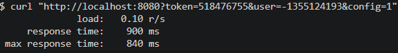
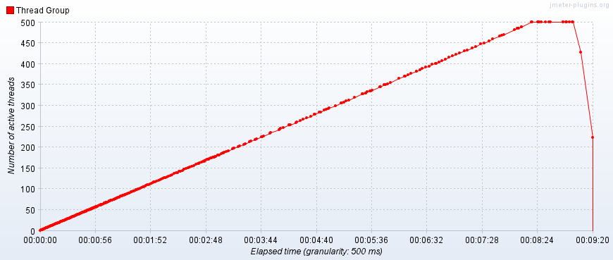
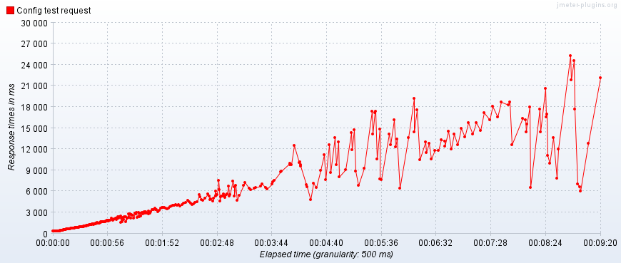
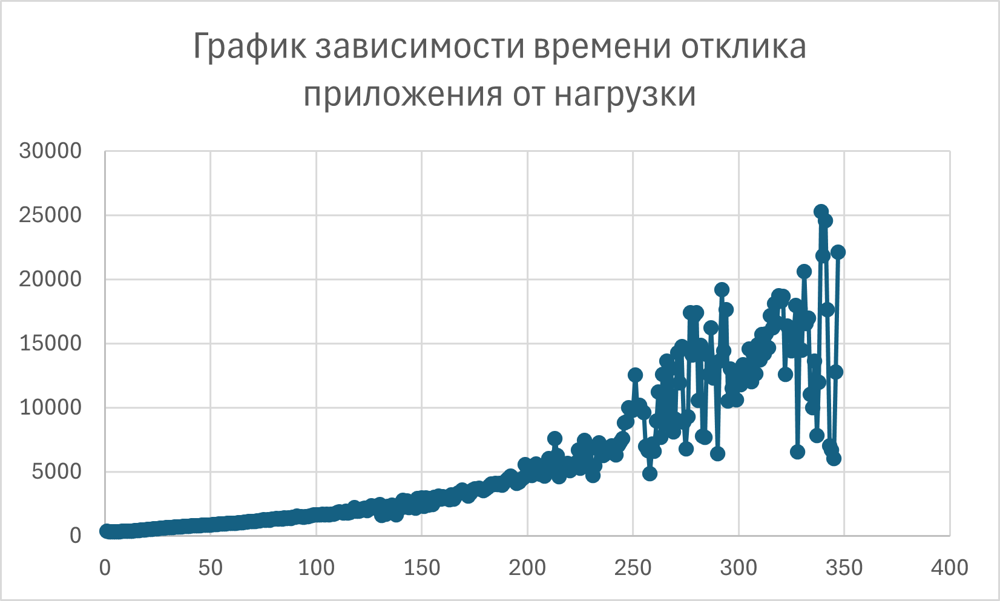

# Лабораторная работа №4

## Вариант 2

- Сделал: Козьяков Арсений Дмитриевич
- Проверила: Наумова Надежда Александровна

## Задание

С помощью программного пакета [Apache JMeter](http://jmeter.apache.org/) провести нагрузочное и стресс-тестирование веб-приложения в соответствии с вариантом задания.

В ходе нагрузочного тестирования необходимо протестировать 3 конфигурации аппаратного обеспечения и выбрать среди них наиболее дешёвую, удовлетворяющую требованиям по максимальному времени отклика приложения при заданной нагрузке (в соответствии с вариантом).

В ходе стресс-тестирования необходимо определить, при какой нагрузке выбранная на предыдущем шаге конфигурация перестаёт удовлетворять требованиями по максимальному времени отклика. Для этого необходимо построить график зависимости времени отклика приложения от нагрузки.

- Приложение для тестирования доступно только во внутренней сети кафедры.

- Если запрос содержит некорректные параметры, сервер возвращает HTTP 403.

- Если приложение не справляется с нагрузкой, сервер возвращает HTTP 503.

Параметры тестируемого веб-приложения:
URL первой конфигурации ($ 1200) - <http://stload.se.ifmo.ru:8080?token=518476755&user=-1355124193&config=1>;  
URL второй конфигурации ($ 1900) - <http://stload.se.ifmo.ru:8080?token=518476755&user=-1355124193&config=2>;  
URL третьей конфигурации ($ 2000) - <http://stload.se.ifmo.ru:8080?token=518476755&user=-1355124193&config=3>;

Максимальное количество параллельных пользователей - 12;
Средняя нагрузка, формируемая одним пользователем - 40 запр. в мин.;
Максимально допустимое время обработки запроса - 880 мс.

## Выполение

Поскольку

> Приложение для тестирования доступно только во внутренней сети кафедры.

Перед тетсированием необходимо пробросить порт на локальную машину
для этого введем команду:

```bash
ssh -p2222 -L 8080:stload.se.ifmo.ru:8080 s408815@se.ifmo.ru
```

и проверим доступность:

```bash
curl "http://localhost:8080?token=518476755&user=-1355124193&config=1"
```



Посольку нагрузочное и стресс тестирование разных конфигураций отличается лишь параметром в URL, имеет смысл разделить тесты следующим образом: создать [файл с нагрузочным тестированием](./Load%20tesiting.jmx) и [файл со стресс тестированием]().

Запуск тестов происходит по команде

```bash
jmeter -f -n -t "TesitingTemplate.jmx" -q test.properties -l results.csv -e -o ./report
```

| Флаг | Расшифровка                      | Описание                                                                                      |
| :--- | :------------------------------- | :-------------------------------------------------------------------------------------------- |
| -f   | --forceDeleteResultFile          | force delete existing results files and web report folder if present before starting the test |
| -n   | --nongui                         | run JMeter in nongui mode                                                                     |
| -t   | --testfile \<argument>           | the jmeter test(.jmx) file to run                                                             |
| -q   | --addprop \<argument>            | additional JMeter property file(s)                                                            |
| -l   | --logfile \<argument>            | the file to log samples to                                                                    |
| -e   | --reportatendofloadtests         | generate report dashboard after load test                                                     |
| -o   | --reportoutputfolder \<argument> | output folder for report dashboard                                                            |

Посольку конфигурация вынесена в отдельный [файл](./test.properties), то чтобы поменять вид тетсирования с нагрузочного на стресс, надо лишь поменять несколько параметров - количество пользователей (выставить число, намного превышающее заданное) и время между запросами (чтобы получился наглядный график).

### Load testing

В задании написано, что надо

> протестировать 3 конфигурации аппаратного обеспечения и выбрать среди них наиболее дешёвую, удовлетворяющую требованиям по максимальному времени отклика приложения при заданной нагрузке

В этом тесте немаловажный параметр - **ramp up time** - время в течении которого запускаются все потоки, поскольку в задании не написано, как пользователи начинают слать запросы (все сразу или в течение времени), то каждый конфиг проверим по два раза - с одновременным запуском (0 секнуд) пользователей и распределенным по времени (12 секунд).

#### Анализ результатов

| Config | Ramp-up time | Test result        |
| :----- | :----------- | ------------------ |
| 1      | 0            | :x:                |
| 1      | 12           | :x:                |
| 2      | 0            | :x:                |
| 2      | 12           | :x:                |
| 3      | 0            | :white_check_mark: |
| 3      | 12           | :white_check_mark: |

Таким образом, можем заметить, что нам подходит третья конфигурация.

#### Стоило ли учитывать разный Ramp up?

Если сравнить результаты первого конфига с маленьким и с нормальным ramp up, то можно заметить, как этот критерий напрямую влияет на результаты тестов: в [первом случае](./loadResults/smallRumpUp/config1.csv) количество ошибок 240, во [втором](./loadResults/normalRumpUp/config1.csv) же 200. Аналогичная ситуация и со вторым конфигом: [было](./loadResults/smallRumpUp/config2.csv) 50, [стало](./loadResults/normalRumpUp/config2.csv) 18. Имеет ли смысл тогда увеличить до большого размера этот параметр? Не совсем, поскольку увеличивая его, мы увеличиваем работу теста и отходим от реальных условий к более простым и в реальности наше приложение может принести убытки, не смотря на прохождение тестов, делая их по факту бесполезными.

### Stress Testing

Изменим следущие [конфигурацию](./stress.properties): добавим большое количество потоков, неограничиваем частоту запросов, а также увеличим длительность теста и ramp up для более наглядного графика.

#### Графики





## Вывод

В ходе лабораторной работы я вспомнил как работать с Apache JMeter, узнал что такое нагрузочное тестирование, протестировал несколько конфигураций и выбрал подходящую, а на выбранной конфигурации провел стресс тестирование.
